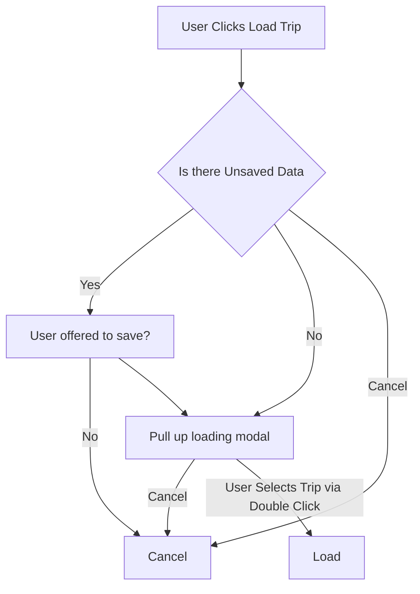

```mermaid
    graph TD
    A[User Clicks Load Trip] -->D{Is there Unsaved Data}
    D-- Yes --> C[User offered to save?]
    D-- No --> G[Pull up loading modal]
    C -- No --> F[Cancel]
    
    D -- Cancel --> F[Cancel]
    C-->G
    G -- Cancel --> F[Cancel]
    G -- User Selects Trip via Double Click -->H[Load]
    
```

