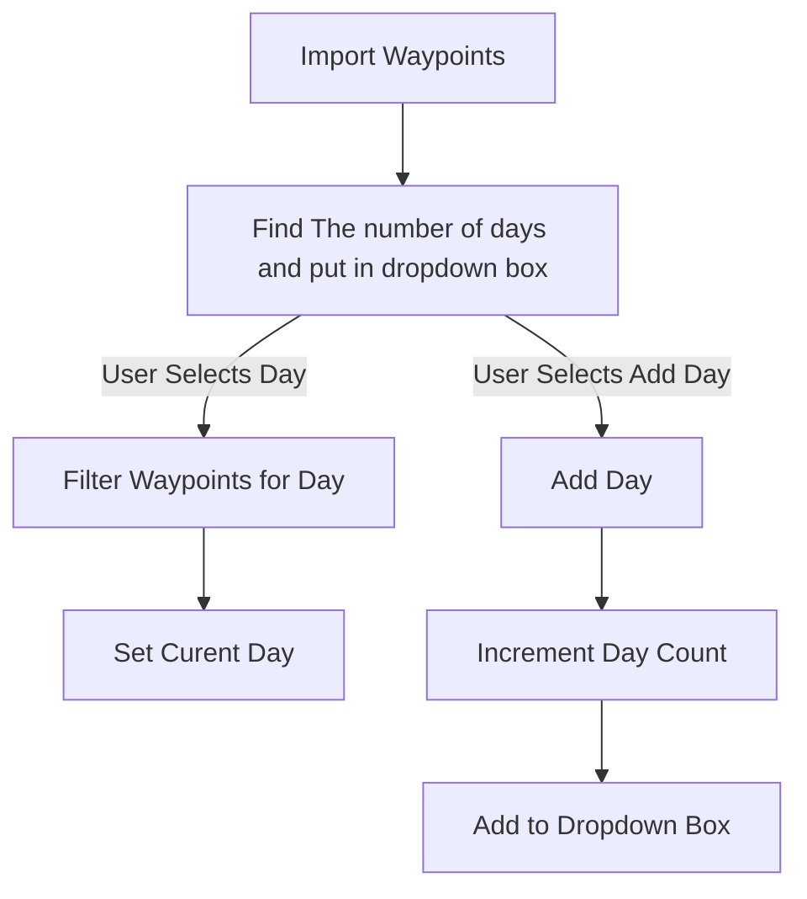
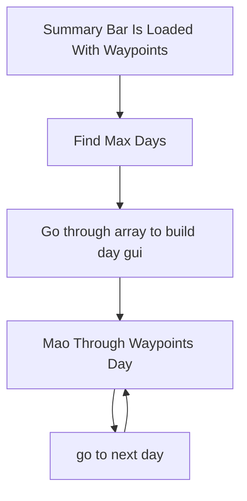

# Roadmap: Iter Viae v0.9 – Rationem

## 1. Data Model & Day-Management Infrastructure

- [x] **Schema Refactoring**
  Update the `Waypoint` data structure to include `day_index: u32` and `stop_index: u32`. Ensure the save/load functions in `storage.rs` are updated to support this hierarchical schema.

- [ ] **Dropdown Controller**
  Implement a global `activeDay` state in React.
  - **Add Logic:** Implement a function to append a new day index and set `activeDay` to the new value.
  - **Delete Logic:** Implement a "Delete Day" trigger in the dropdown that invokes a confirmation modal.

- [ ] **Re-indexing Engine**
  Develop the `realign_itinerary()` function (ideally in Rust/Backend) to run after any day deletion, ensuring all remaining waypoints maintain a contiguous `day_index` and `stop_index` sequence.

## 2. The "Rationem" Dashboard (Planning Panel)

- [ ] **Panel Integration**
  Add a "Spreadsheet View" toggle to the existing right-hand POI panel.

- [ ] **Layout Logic**
  Implement a dynamic layout shift: when "Spreadsheet View" is active, prioritize screen real estate by compressing the primary sidebar to allow for a full-width itinerary table.

- [ ] **Spreadsheet Interface**
  Build an editable table with the following data-dense columns:
  - **Stop Name/Note:** Editable text field.
  - **Break Time Budget:** Editable numeric input (in minutes).
  - **Stop Type:** Dropdown selector (e.g., Fuel, Rest, Maintenance, Waypoint).
  - **Arrival/Departure Timestamps:** Calculated read-only fields.

## 3. Calculation Engine (The "Rationem" Core)

- [ ] **Arrival/Departure Algorithm**
  Implement a backend calculation engine that consumes the waypoint list:
  - **Input:** Travel Time (from navigation API) + Break Time (user input).
  - **Output:** Sequential Arrival and Departure times for every stop.

- [ ] **Daily Metrics**
  Create a daily summary component that aggregates Total Distance, Total Moving Time, and Total Break Time for the `activeDay`.

- [ ] **Global Mission Stats**
  Add a fixed-footer "Global Dashboard" to the Spreadsheet View displaying:
  - **Total Trip Duration** (Days/Hours)
  - **Total Distance** (Miles/KM)
  - **Total Fuel Stops Required**

## 4. Advanced Features

- [ ] **Fuel Tracking**
  Implement intelligent fuel tracking based on vehicle range and trip distance.
  - Waypoints will be highlighted in red when a fuel stop is required before reaching them.
  - Provide an "Ignore" option for users who want to override the fuel warning for specific waypoints.

- [ ] **Trip Start Date**
  Add a global trip start date configuration.
  - Enables accurate calendar day calculations (e.g., converting "Day 1", "Day 2" into actual dates).

- [ ] **Roadbook Printing**
  Generate and print a full-fledged roadbook directly from the trip itinerary.
  - Support formatting for multiple page dimensions: Standard Letter, Field Notes, and 3x5 index cards.

### Days Dropdown Flow Chart

### Foiling the Days for itin

